# 읽담 (bookbook)

> 책과 대화하는 독서 기록 앱 — 검색하고, 담고, 한 줄로 기록하고, 책탑을 쌓음.

<p align="left">
  
  
  
  
</p>

읽담은 책을 검색해 내 책장에 담고, **책한줄** 리뷰를 남기면 책을 모아 **책탑**을 쌓아가는 iOS 독서 기록 앱임.

<!-- 캡처 후 아래 주석을 해제하세요 -->
<!--  -->

*English version below — [jump to English](#bookbook-english)*

---

## 프로젝트 개요

| 구분 | 내용 |
|---|---|
| 기간 | 2025.09 ~ 2026.07 (약 10개월) |
| 팀 구성 | **2인** — 디자이너 1 · iOS 개발 1(본인) |
| 담당 역할 | **기획 공동 · iOS 개발 전담** — 앱 전 화면 단독 구현 |
| 플랫폼 | iOS 17.0+ |
| 규모 | Swift 13,046 LOC · 커밋 255개 |
| 저장 방식 | 로컬 전용 (CoreData, 백엔드 없음) |

### 담당 범위

디자이너 1명과 **2인 팀**으로 진행했고, 기획은 함께, **iOS 앱은 전 화면·전 기능을 단독으로 구현**함.

- 앱 전체 화면 구현 (온보딩 · 홈 · 검색 · 상세 · 내책장 · 책한줄 · 책탑쌓기 · 마이페이지)
- 게이미피케이션(책탑쌓기) 보상 구조 설계 및 구현
- 알라딘 오픈 API 연동 및 응답 정제 (네이버 책 API 종료 후 상세 조회를 알라딘 ItemLookUp으로 이관)
- CoreData 데이터 모델 설계 및 계정별 데이터 격리
- 공통 컴포넌트 제작 (커스텀 얼럿 · 토스트 · 로딩 뷰 · 페이지네이션 바)

---

## 기획 배경

### 문제 정의

독서 기록 앱은 이미 많지만, 대부분 **기록 자체가 목적**임. 문제는 기록이 귀찮다는 것보다 **계속할 이유가 없다는 것**이었음.

- 리뷰를 길게 쓰라고 하면 부담스러워서 안 씀
- 기록을 쌓아도 눈에 보이는 변화가 없으니 금방 그만둠

### 해결 방향

읽담은 이 둘을 각각 겨냥함.

| 문제 | 기획적 해결 | 구현 |
|---|---|---|
| 기록이 부담스럽다 | 리뷰 단위를 **"한 줄"** 로 축소 | 책한줄 — 별점 + 한 문장 + 읽은 날짜만 입력 |
| 계속할 이유가 없다 | 기록이 **눈에 보이게 쌓이는** 보상 구조 | 책탑쌓기 — 책한줄을 모아 9단계 책 획득 |
| 어떤 책을 읽을지 모른다 | 온보딩에서 **취향을 먼저 수집** | 장르·연령대·성별 기반 맞춤 추천 |

---

## 핵심 기획 — 책탑쌓기

이 앱의 차별점이자, 가장 공들인 기획임. 단순히 "리뷰 쓰면 배지 준다"가 아니라 **이탈 구간을 고려한 보상 곡선**을 설계함.

### 보상 곡선 설계

책은 총 9단계이고, 각 단계에 필요한 책한줄 수를 **점진적으로 늘림**.

| 단계 | 획득 책 | 구간 필요 수 | 누적 필요 수 |
|:--:|---|--:|--:|
| 1 | 전래동화 | 3 | **3** |
| 2 | 이솝우화 | 5 | 8 |
| 3 | 영어책 | 10 | 18 |
| 4 | 자서전 | 15 | 33 |
| 5 | 추리소설 | 20 | 53 |
| 6 | 세계지도 | 25 | 78 |
| 7 | 요리책 | 30 | 108 |
| 8 | 우주과학 | 35 | 143 |
| 9 | 백과사전 | 40 | **183** |

설계 의도:

- **첫 보상은 3개** — 초기 이탈이 가장 심한 구간이라, 시작하자마자 성취를 경험하게 함
- **간격을 점진적으로 확대** — 습관이 붙은 뒤에는 보상을 희소하게 만들어 가치를 유지
- **책의 종류가 성장 서사** — 전래동화(어린이) → 백과사전(지식의 총합). 단계가 곧 독서 수준의 은유
- **최종 책은 연출을 다르게** — 백과사전 획득 시 팝업 배경을 그라데이션으로, confetti를 카드 밖으로 넘치게 재생해 "끝까지 왔다"를 시각적으로 구분

```swift
static let all: [BookReward] = [
    BookReward(count: 3,  name: "전래동화",   imageName: "book_fairytale"),
    BookReward(count: 5,  name: "이솝우화",   imageName: "book_aesop"),
    // ...
    BookReward(count: 40, name: "백과사전",   imageName: "book_encyclopedia"),
]
```

### 빈 상태(Empty State)를 기획하다

책을 하나도 못 받은 사용자가 책탑 화면에 들어오면 **아무것도 없는 화면**을 보게 됨. 이게 첫인상이 되면 앱을 다시 안 열게 됨.

그래서 0개 상태 전용 화면을 따로 설계함 — 어두운 오버레이 위에 Lottie 조명 애니메이션과 물음표 책을 띄워, **"아직 없다"가 아니라 "곧 채워질 자리"** 로 읽히게 함.

---

## 화면 흐름

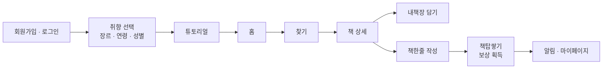

온보딩에서 취향을 **먼저** 받는 이유는, 첫 진입 시 홈이 비어 보이지 않게 하기 위함임. 취향 정보가 있어야 첫 화면부터 추천 도서를 채울 수 있음.

---

## 화면 및 기능

### 탭 구성

|  |  |  |  |  |
|:---:|:---:|:---:|:---:|:---:|
| 홈 | 찾기 | 내책장 | 책한줄 | 내공간 |

### 온보딩 · 홈 · 검색

| 회원가입 | 취향 선택 | 홈 | 찾기 |
|:---:|:---:|:---:|:---:|
|  |  |  | 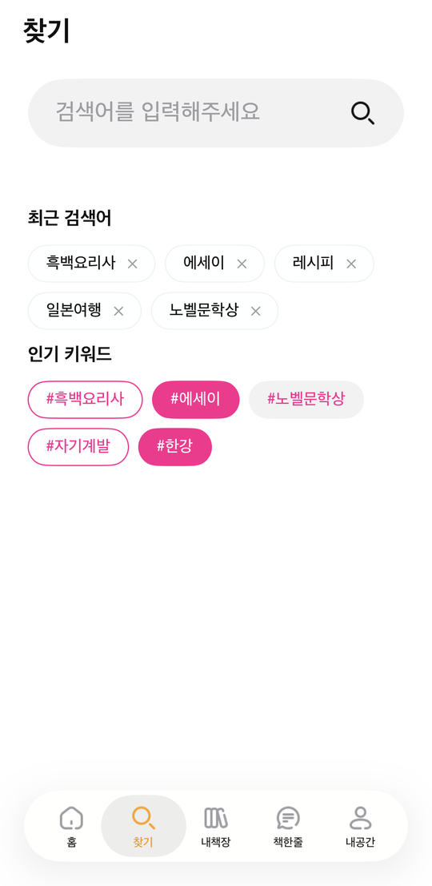 |

- **온보딩** — 휴대폰 번호 기반 로컬 가입, 취향(장르·연령대·성별) 수집, 첫 진입 튜토리얼
- **홈** — 맞춤 추천 / 마음 랭킹 / 베스트셀러 · 신간(알라딘) / 명언 카드 / 당겨서 새로고침
- **찾기** — 알라딘 검색, 정렬(정확도 · 추천 · 최신), 장르 필터, 페이지네이션, 인기·최근 검색어

### 상세 · 내책장 · 책한줄

| 검색 결과 | 책 상세 | 내책장 | 책한줄 | 책한줄 작성 |
|:---:|:---:|:---:|:---:|:---:|
| 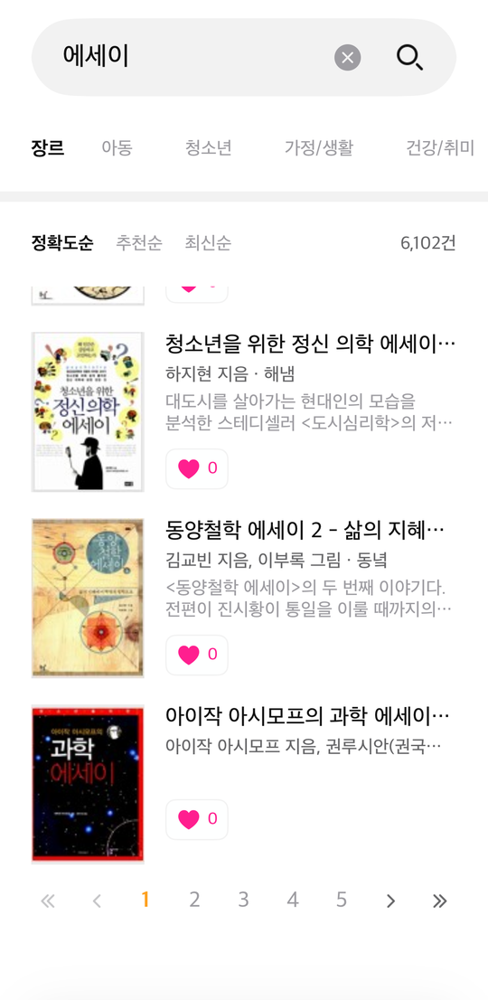 | 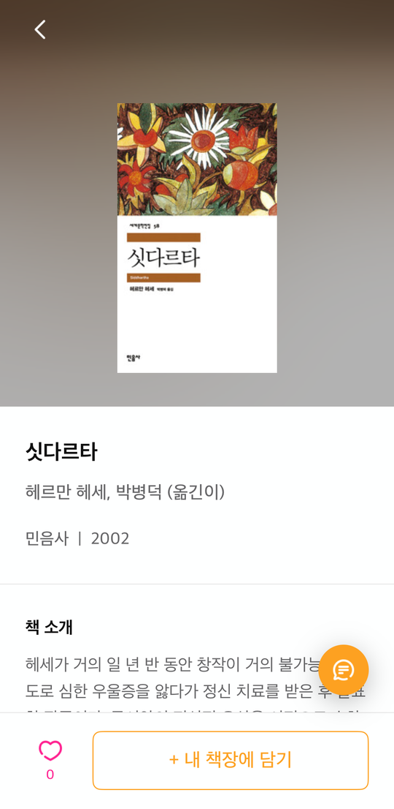 |  | 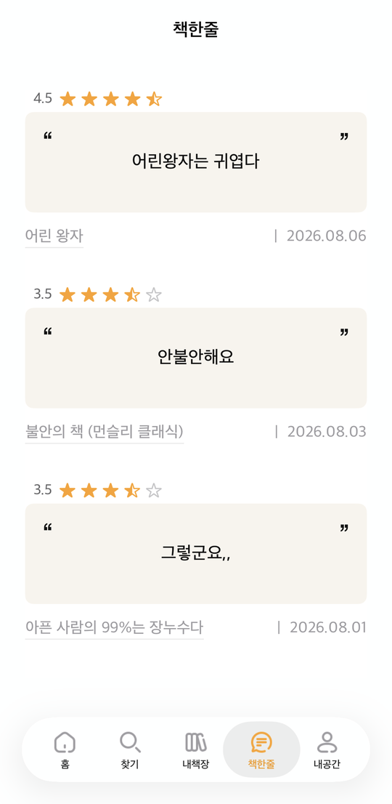 | 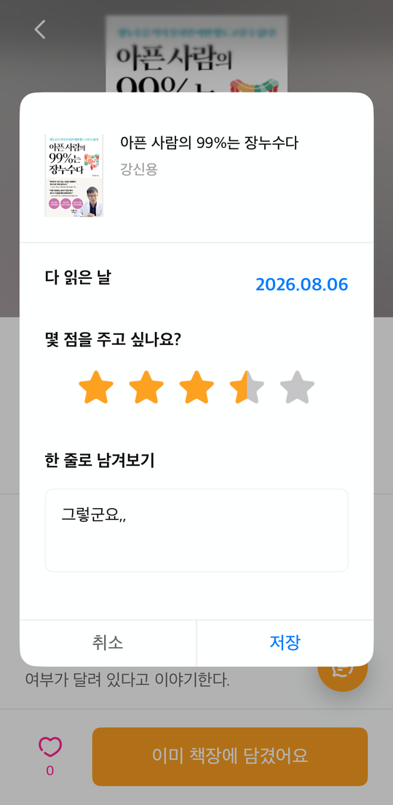 |

- **책 상세** — 알라딘 도서 상세 정보, 마음(좋아요) · 내책장 담기 · 책한줄 작성
- **내책장 · 마음서랍** — 북마크/좋아요한 책 (장르 필터 · 페이지네이션)
- **책한줄** — 한 줄 리뷰 작성 / 수정 / 삭제, 별점 · 읽은 날짜 기록

### 책탑쌓기 · 내공간

| 빈 상태 | 책탑 | 보상 팝업 | 최종 보상 | 내공간 |
|:---:|:---:|:---:|:---:|:---:|
| 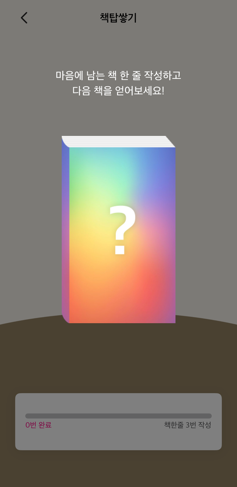 | 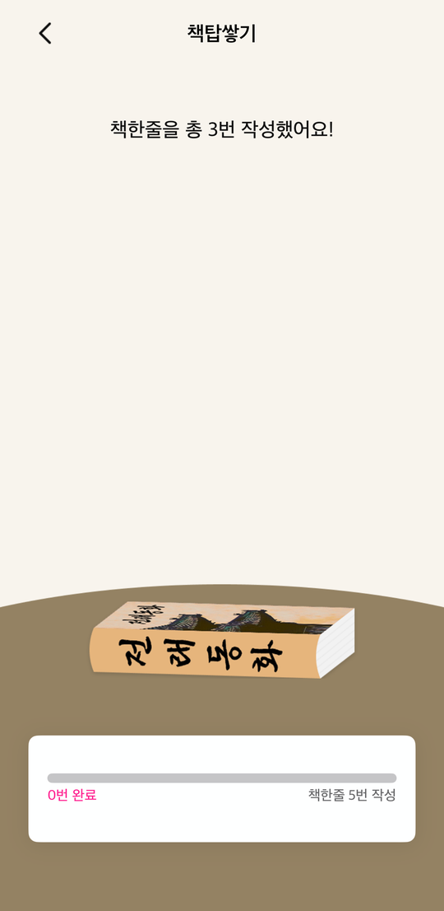 | 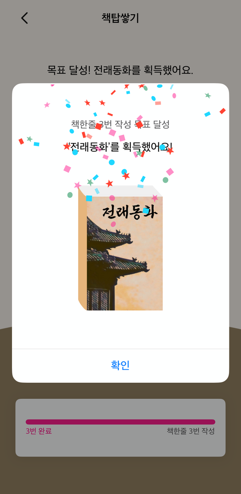 |  | 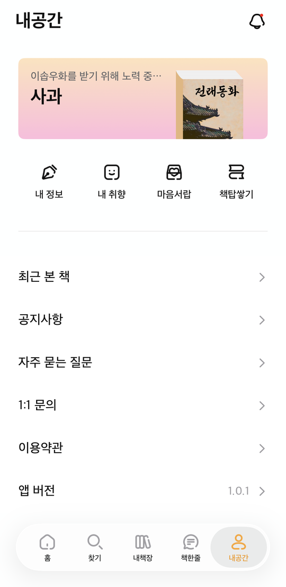 |

- **책탑쌓기** — 9단계 보상, 획득 애니메이션 + 진행 게이지 + 보상 팝업
- **알림** — 로컬 푸시(새 책 획득 · 독서 리마인더) + 앱 내 알림함(안읽음 배지), 반복 요일·시간·횟수 설정
- **내공간** — 프로필 카드, 내 정보 · 내 취향 · 최근 본 책 · 공지/FAQ · 1:1 문의 · 이용약관

### 알림 · 인터랙션

| 푸시 알림 | 로딩 | 알림 설정 | 알림함 | 마음 표현 |
|:---:|:---:|:---:|:---:|:---:|
| 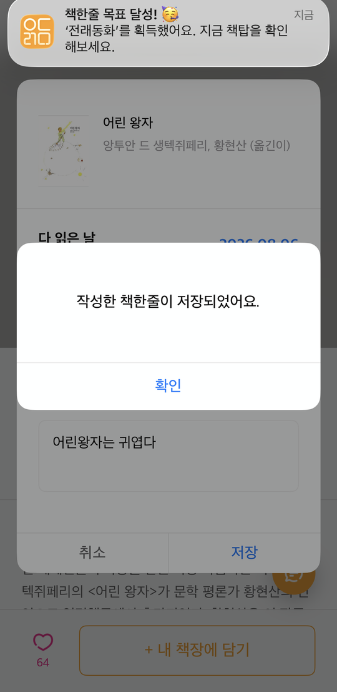 |  | 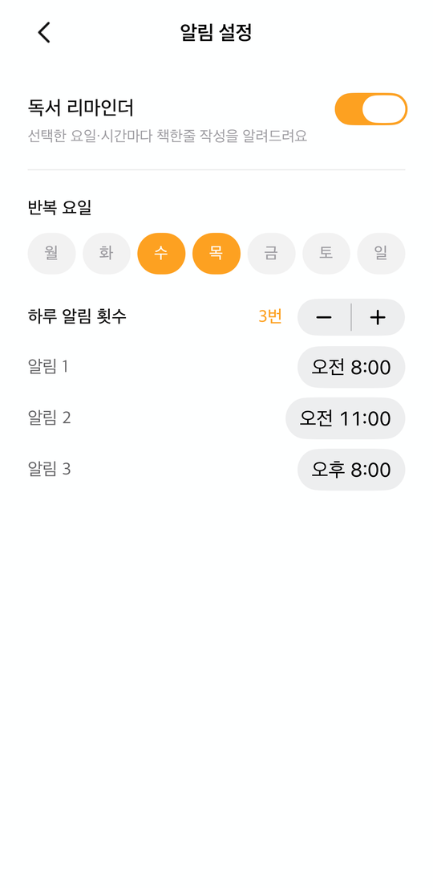 |  |  |

책한줄을 저장하는 순간 시스템 로컬 푸시가 발송되고, 앱 내 알림함에도 함께 쌓임. 리마인더는 반복 요일 · 시간 · 하루 횟수를 각각 지정할 수 있음.

### 온보딩 · 탐색

| 연령 선택 | 성별 선택 | 마음 랭킹 | 마음서랍 | 최근 본 책 |
|:---:|:---:|:---:|:---:|:---:|
|  |  |  |  | 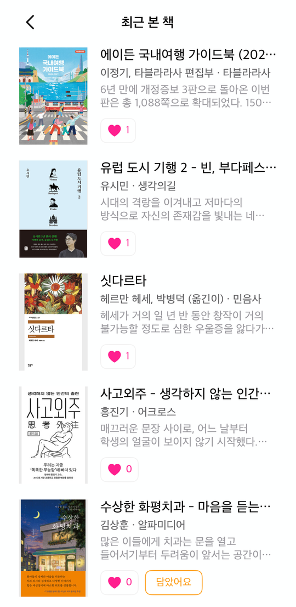 |

### 내공간 · 정책

| 내 취향 | 내 정보 | 공지 · FAQ | 1:1 문의 | 문의하기 |
|:---:|:---:|:---:|:---:|:---:|
|  |  | 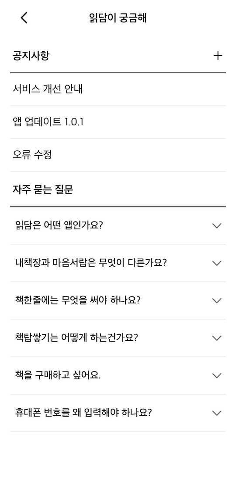 | 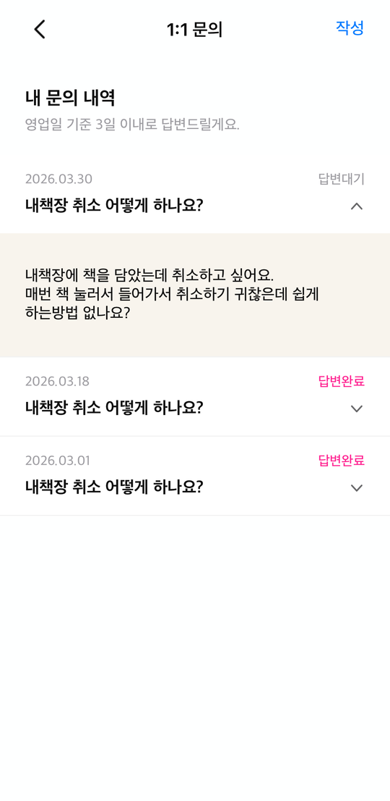 | 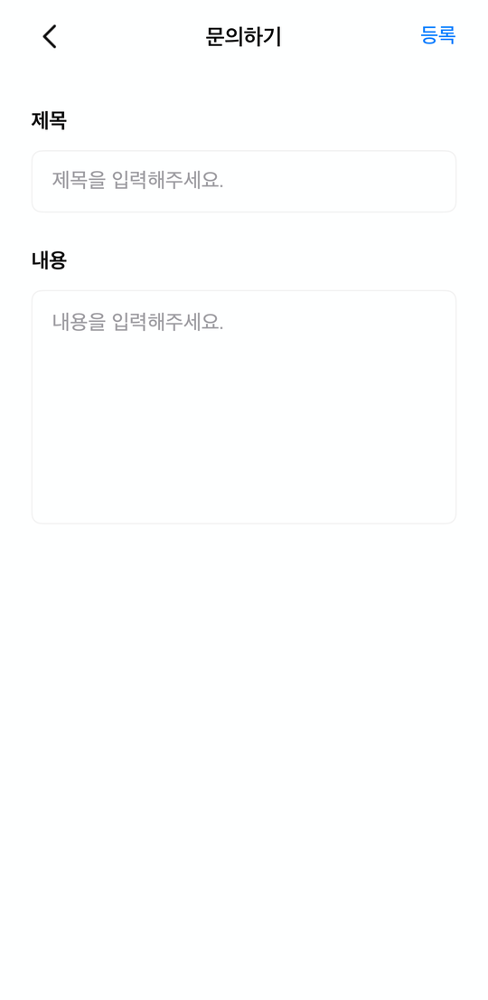 |

| 이용약관 | 앱 버전 |
|:---:|:---:|
| 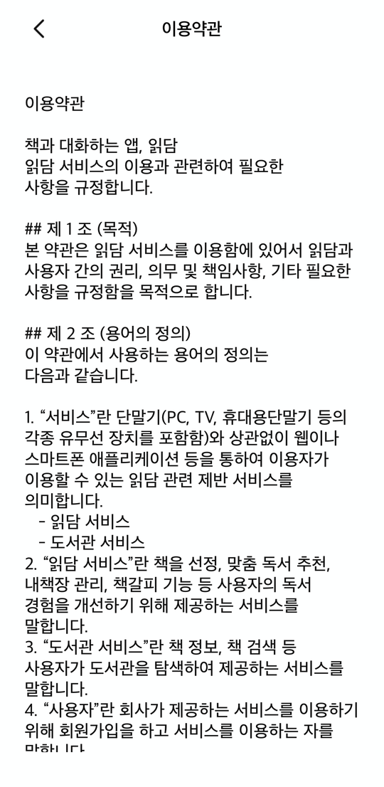 | 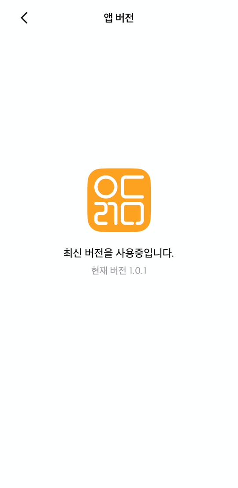 |

### 책 획득 애니메이션

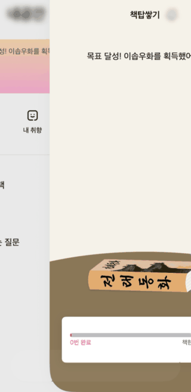

책한줄이 목표치에 도달하면 책이 떨어져 책탑에 쌓이고, 보상 팝업이 뜬다.
정지 이미지로는 전달되지 않는 이 앱의 핵심 순간.

---

## 기술 스택

| 구분 | 사용 기술 |
|---|---|
| 언어 / 패턴 | Swift · UIKit · MVC |
| 레이아웃 | SnapKit (코드 기반 오토레이아웃, 스토리보드 미사용) |
| 네트워크 | Alamofire |
| 이미지 | Kingfisher (GIF: AnimatedImageView) |
| 애니메이션 | Lottie · SF Symbols `drawOn`/`drawOff` |
| 로컬 저장 | CoreData |
| 알림 | UserNotifications (로컬 푸시) |
| 오픈 API | 알라딘 도서 API (ItemSearch · ItemList · ItemLookUp) |

### 폴더 구조

```
bookbook/
├── CoreData/        데이터 모델 · 영속화 계층
├── Extensions/      UIKit 확장
├── Model/           도메인 모델 · API 응답 모델
├── Protocols/       프로토콜 정의
├── Repositories/    데이터 조회 계층
├── Utils/           네트워크 · 세션 · 알림 · 로딩 매니저
├── ViewControllers/ 화면
└── Views/           커스텀 뷰 · 셀
```

---

## 구현 하이라이트

기능을 나열하는 대신, **문제를 만나고 어떻게 판단했는지**를 6가지로 정리함.

### 1. 전 화면 상태 동기화

**문제** — 같은 책이 홈 · 검색 · 상세 · 내책장 네 곳에 동시에 보임. 상세에서 마음을 눌렀는데 뒤로 가면 이전 상태 그대로면, 사용자는 저장이 안 된 줄 알고 다시 누름.

**판단** — 화면마다 갱신 코드를 넣으면 화면이 늘어날 때마다 누락이 생김. 상태 변경 **지점**에서 한 번만 알리고, 관심 있는 화면이 각자 구독하는 구조로 감.

```swift
extension Notification.Name {
    static let bookLikeDidChange     = Notification.Name("bookLikeDidChange")
    static let bookBookmarkDidChange = Notification.Name("bookBookmarkDidChange")
}

func postBookStateChange(name: Notification.Name, isbn13: Int) {
    NotificationCenter.default.post(name: name, object: nil,
                                    userInfo: [BookSyncKey.isbn13: isbn13])
}
```

CoreData 저장 직후 항상 발행하도록 `toggleBookmark` · `incrementLikeCount` · `decrementLikeCount` 등 **변경이 일어나는 모든 함수에 못 박음**. `isbn13`을 함께 실어 보내 구독 측이 해당 셀만 갱신하도록 함.

**결과** — 어느 화면에서 눌러도 나머지 전 화면에 즉시 반영. 새 화면을 추가해도 구독 한 줄이면 동기화에 편입됨.

### 2. 로딩 스피너가 깜빡이는 문제

**문제** — 요청마다 스피너를 띄웠더니, 캐시가 맞거나 응답이 빠를 때 스피너가 **나타났다 즉시 사라지며 화면이 번쩍임**. 오히려 느려 보였음.

**판단** — 스피너의 목적은 "기다리는 중"을 알리는 것인데, 짧은 대기에는 알릴 필요 자체가 없음. **표시를 0.4초 지연시키고, 그 전에 응답이 오면 아예 띄우지 않음.**

```swift
private let showDelay: TimeInterval = 0.4
private var pendingShow: DispatchWorkItem?

func showLoading(on view: UIView) {
    let work = DispatchWorkItem { [weak self] in
        // 0.4초 뒤에도 여전히 로딩 중일 때만 실제로 표시
    }
    pendingShow = work
    DispatchQueue.main.asyncAfter(deadline: .now() + showDelay, execute: work)
}

func hideLoading() {
    loadingCount = max(0, loadingCount - 1)
    guard loadingCount == 0 else { return }
    pendingShow?.cancel()   // 빠른 응답이면 예약을 취소 — 스피너 자체를 생략
    dismissOverlay()
}
```

동시에 여러 요청이 겹치는 화면(홈: 추천 + 랭킹 + 신간)을 위해 `loadingCount` 로 참조 카운팅해, **마지막 요청이 끝났을 때만** 내림.

**추가 문제** — 스피너를 직접 만들었는데(심볼을 써내려갔다 지우는 애니메이션), 숨기라는 신호가 **획을 그리는 도중**에 오면 글씨가 반쯤 그려진 채 사라져 어색했음. → `finishGracefully`로 **진행 중인 획을 완성한 뒤** 페이드아웃하도록 함.

### 3. SwiftUI 심볼 애니메이션이 동작하지 않던 문제

**문제** — 로딩 뷰의 그리기 효과를 SwiftUI `.symbolEffect(.drawOn)`으로 구현하고 `UIHostingController`로 올렸는데, **전환이 트리거되지 않고 심볼이 투명하게 렌더**됨.

**판단** — 오버레이로 얹은 호스팅 컨트롤러에서는 상태 변화가 애니메이션으로 이어지지 않는 것으로 보고, UIKit 네이티브 API로 전환.

```swift
imageView.addSymbolEffect(.drawOn)   // iOS 26+
// iOS 17~25는 .variableColor 로 폴백
```

**결과** — 정상 동작. 구버전 대응까지 포함해 iOS 17부터 동일한 로딩 경험을 제공함.

### 4. 알라딘 API 응답이 JSON으로 파싱되지 않던 문제

**문제** — 알라딘 API를 `Output=JS`로 호출하면 응답 **끝에 세미콜론과 공백이 붙어** 있어 `JSONDecoder`가 실패함.

**판단** — 호출부마다 문자열을 잘라내면 API를 추가할 때마다 같은 코드가 반복됨. Alamofire의 `DataPreprocessor`를 구현해 **디코딩 직전 단계에서 한 번만** 처리.

```swift
struct AladinJSPreprocessor: DataPreprocessor {
    func preprocess(_ data: Data) throws -> Data {
        var d = data
        let trim: Set<UInt8> = [0x3B, 0x20, 0x09, 0x0A, 0x0D]  // ; space tab \n \r
        while let last = d.last, trim.contains(last) { d.removeLast() }
        return d
    }
}

AF.request(url, method: .get, parameters: parameters)
  .validate(statusCode: 200..<300)
  .responseDecodable(of: BookInfo.self, dataPreprocessor: AladinJSPreprocessor()) { ... }
```

**결과** — 호출부 코드는 그대로 두고 파싱 계층에서만 해결. 알라딘 API를 쓰는 4개 엔드포인트가 전부 같은 처리를 공유함.

### 5. 검색 결과에 읽을 수 없는 책이 섞이는 문제

**문제** — "수학"을 검색하면 문제집·교과서가, 소설을 검색하면 **전집 세트와 e-book**이 상위에 나옴. 독서 기록 앱에서 담을 수 없거나 담을 이유가 없는 결과들임.

**판단** — 기획 요구("읽고 기록할 수 있는 책만 보이게")를 API 응답 정제로 해결. 카테고리 ID·카테고리명 키워드·제목 정규식 세 가지를 조합해 걸러냄.

```swift
var isExcludedCategory: Bool {
    if BookData.excludedCategoryIds.contains(categoryId) { return true }
    return BookData.excludedCategoryKeywords.contains { categoryName.contains($0) }
}
var isSetBook: Bool {
    if BookData.excludedTitleKeywords.contains(where: { title.contains($0) }) { return true }
    return BookData.volumeSetPatterns.contains { title.range(of: $0, options: .regularExpression) != nil }
}
```

응답 모델에 `filteringExcluded()`를 두어, **네트워크 계층을 통과하는 모든 결과가 자동으로 정제**되도록 함.

### 6. 한 기기에 여러 계정 — 데이터 격리

**문제** — 백엔드가 없어 모든 데이터가 기기에 저장됨. 계정을 바꿔 로그인했더니 **이전 계정의 최근 검색어·인기 검색어·튜토리얼 노출 여부가 그대로** 보임. `UserDefaults`를 계정 구분 없이 썼기 때문.

**판단** — 키에 계정 UUID를 네임스페이스로 붙이는 단일 진입점을 만들고, 계정별 저장은 **반드시 이 함수를 통하도록** 규칙화.

```swift
static func scopedKey(_ base: String) -> String {
    "\(base)_\(currentAccountUUID?.uuidString ?? "guest")"
}
```

CoreData 쪽은 `Account` 엔티티와의 관계로 분리하고, 조회 시 항상 현재 계정을 조건에 포함:

```swift
request.predicate = NSPredicate(format: "isbn13 == %lld AND account == %@", Int64(isbn13), account)
```

**결과** — 탈퇴 시 해당 계정의 키와 CoreData만 삭제되고 다른 계정은 보존됨. 서버가 붙더라도 계정 단위 구조가 이미 잡혀 있어 동기화 계층만 얹으면 됨.

---

## 인증 및 데이터 저장 방식

포트폴리오용 데모로, 별도의 백엔드 서버 없이 **CoreData 기반 로컬 전용**으로 구현함.

- 회원가입 · 로그인은 기기 내 로컬 계정으로 동작하며, 입력한 휴대폰 번호는 형식 검증만 수행함 (SMS 인증 · 비밀번호 없음).
- 모든 데이터는 기기의 CoreData에 저장되어, 앱 삭제 또는 기기 변경 시 초기화됨.
- **마음(좋아요) · 랭킹**: 원래 기획은 모든 사용자의 마음을 서버에 누적해 랭킹에 반영하는 구조이나, 백엔드가 없어 마음 랭킹은 **데모 시드 데이터를 기준으로 표시**되며 기기 내 마음을 누적·확장 가능한 형태로 설계함.

> **실 서비스로 확장 시 필요한 작업**
> - 휴대폰 번호 SMS(OTP) 인증
> - 서버/클라우드 DB + 동기화(CloudKit · Firebase 등)를 통한 기기 간 데이터 이전
> - 전체 사용자 마음(좋아요)을 합산한 실시간 랭킹 집계

이는 데모 범위를 명확히 하기 위한 **의도적인 설계 선택임**.

---

## 실행 방법

1. 저장소 클론 후 Xcode에서 `bookbook.xcodeproj` 열기 (iOS 17+)
2. `bookbook/Secret.swift.example`을 같은 폴더에 복사 → `Secret.swift`로 이름 변경 후 API 키 입력 (알라딘 TTB Key)
   - `Secret.swift`는 `.gitignore`로 제외돼 GitHub에 올라가지 않음(받은 프로젝트엔 없으니 직접 생성 필요).
   - 키는 XOR 난독화(`Utils/SecretObfuscator.swift`)를 거쳐 사용됨.
   - 실제 키 값은 프로젝트 관리자에게 요청.
3. 빌드 & 실행

---
---

# bookbook (English)

> A reading-record app for conversing with books — search, save, jot a one-line review, and build a book tower.

bookbook is an iOS reading-record app: search for books, save them to your shelf, leave **one-line reviews (책한줄)**, and collect books to build a **book tower (책탑)**.

## Project Overview

| | |
|---|---|
| Duration | Sep 2025 – Jul 2026 (~10 months) |
| Team | **2 people** — 1 designer · 1 iOS developer (me) |
| My role | **Co-planning · sole iOS developer** — built every screen myself |
| Platform | iOS 17.0+ |
| Scale | 13,046 lines of Swift · 255 commits |
| Storage | Local-only (CoreData, no backend) |

### Scope of My Work

A **two-person team** with one designer. We planned together, and I **built the entire iOS app single-handedly**.

- All screens (onboarding · home · search · detail · shelf · reviews · book tower · my page)
- Designed and implemented the gamification (book tower) reward system
- Aladin open API integration and response sanitization (moved detail lookup to Aladin ItemLookUp after the Naver book API shut down)
- CoreData model design and per-account data isolation
- Shared components (custom alert · toast · loading view · pagination bar)

---

## Why This App

### The Problem

There is no shortage of reading-record apps, but most treat **recording as the goal**. The real issue wasn't that logging is tedious — it was that there's **no reason to keep doing it**.

- Asking for a long review feels like work, so people don't write one
- Even after logging, nothing visibly changes, so people quit early

### The Approach

bookbook targets each of these directly.

| Problem | Design decision | Implementation |
|---|---|---|
| Reviewing feels heavy | Shrink the unit to **one line** | Rating + one sentence + read date, nothing else |
| No reason to continue | A reward loop that **visibly accumulates** | Book tower — 9 books earned from collected reviews |
| Don't know what to read | Collect **taste up front** during onboarding | Recommendations by genre · age · gender |

---

## Core Design — The Book Tower

The app's key differentiator, and where most of the design effort went. Not "write a review, get a badge" — a **reward curve shaped around drop-off points**.

### Reward Curve

Nine books total, with the reviews required for each step **increasing progressively**.

| Step | Book | Reviews (step) | Cumulative |
|:--:|---|--:|--:|
| 1 | Folk Tales | 3 | **3** |
| 2 | Aesop's Fables | 5 | 8 |
| 3 | English Book | 10 | 18 |
| 4 | Autobiography | 15 | 33 |
| 5 | Mystery Novel | 20 | 53 |
| 6 | World Atlas | 25 | 78 |
| 7 | Cookbook | 30 | 108 |
| 8 | Space Science | 35 | 143 |
| 9 | Encyclopedia | 40 | **183** |

Rationale:

- **First reward at 3** — drop-off is steepest at the start, so the user experiences success almost immediately
- **Widening intervals** — once the habit forms, rewards become scarcer to preserve their value
- **The books themselves are a growth narrative** — folk tales (childhood) → encyclopedia (the sum of knowledge); each step is a metaphor for reading maturity
- **The final book is staged differently** — a gradient card background and confetti that deliberately overflows the card, so "you made it to the end" reads visually

### Designing the Empty State

A user with zero books earned would open the tower screen and see **nothing**. If that becomes their first impression, they don't come back.

So the zero state got its own screen: a dimmed overlay with a Lottie light animation and a question-mark book — framing it not as *"there's nothing here"* but as *"a space about to be filled."*

---

## User Flow

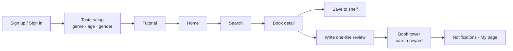

Taste is collected **before** the home screen for a reason: without it, a first-time user's home would be empty. Having preferences up front means the very first screen can be filled with recommendations.

---

## Screens & Features

### Tabs

|  |  |  |  |  |
|:---:|:---:|:---:|:---:|:---:|
| Home | Search | Shelf | Review | My Space |

| Sign up | Taste setup | Home | Search |
|:---:|:---:|:---:|:---:|
|  |  |  |  |

| Results | Detail | Shelf | Reviews | Write a review |
|:---:|:---:|:---:|:---:|:---:|
|  |  |  |  |  |

| Empty tower | Tower | Reward | Final reward | My Space |
|:---:|:---:|:---:|:---:|:---:|
|  |  |  |  |  |

- **Onboarding** — phone-number-based local sign-up, taste collection, first-launch tutorial
- **Home** — personalized recommendations / likes ranking / bestsellers · new releases / quote card / pull-to-refresh
- **Search** — Aladin search, sort (accuracy · recommended · newest), genre filter, pagination, popular & recent terms
- **Detail** — Aladin book details, like · save to shelf · write a review
- **Shelf & Likes drawer** — bookmarked / liked books with genre filter and pagination
- **One-line review** — create / edit / delete, with rating and read date
- **Book tower** — 9 reward steps, earn animation + progress gauge + reward popup
- **Notifications** — local push (book earned · reading reminder) + in-app inbox with unread badge; configurable repeat days · times · count
- **My Space** — profile card, my info · preferences · recently viewed · notices/FAQ · inquiry · terms

### Notifications & Interactions

| Push | Loading | Reminder | Inbox | Like |
|:---:|:---:|:---:|:---:|:---:|
|  |  |  |  |  |

Saving a one-line review fires a system local push and adds an entry to the in-app inbox. The reminder lets you set repeat days, times, and how many times per day independently.

### Onboarding & Discovery

| Age | Gender | Ranking | Likes drawer | Recently viewed |
|:---:|:---:|:---:|:---:|:---:|
|  |  |  |  |  |

### My Space & Policy

| Preferences | My info | Notices · FAQ | Inquiries | New inquiry |
|:---:|:---:|:---:|:---:|:---:|
|  |  |  |  |  |

| Terms | App version |
|:---:|:---:|
|  |  |

### Earning a Book


When reviews reach a threshold, a book drops onto the tower and the reward popup appears —
the app's signature moment, which a still image cannot convey.

---

## Tech Stack

| Category | Technology |
|---|---|
| Language / Pattern | Swift · UIKit · MVC |
| Layout | SnapKit (fully programmatic, no storyboards) |
| Networking | Alamofire |
| Images | Kingfisher (GIF via AnimatedImageView) |
| Animation | Lottie · SF Symbols `drawOn`/`drawOff` |
| Local storage | CoreData |
| Notifications | UserNotifications (local push) |
| Open APIs | Aladin Book API (ItemSearch · ItemList · ItemLookUp) |

---

## Implementation Highlights

Rather than listing features, here are six problems I ran into and how I decided to solve them.

### 1. Keeping State in Sync Across Every Screen

**Problem** — the same book appears on home, search, detail, and the shelf simultaneously. If a user likes a book on the detail screen and goes back to a stale list, they assume it didn't save and tap again.

**Decision** — patching each screen individually means a new screen is a new chance to forget. Instead, publish **once at the point of mutation** and let interested screens subscribe.

```swift
extension Notification.Name {
    static let bookLikeDidChange     = Notification.Name("bookLikeDidChange")
    static let bookBookmarkDidChange = Notification.Name("bookBookmarkDidChange")
}

func postBookStateChange(name: Notification.Name, isbn13: Int) {
    NotificationCenter.default.post(name: name, object: nil,
                                    userInfo: [BookSyncKey.isbn13: isbn13])
}
```

Every mutating function — `toggleBookmark`, `incrementLikeCount`, `decrementLikeCount` — posts immediately after the CoreData save. The `isbn13` rides along so subscribers can refresh just the affected cell.

**Result** — a change anywhere propagates everywhere instantly, and a new screen joins the system with a single subscription.

### 2. The Flickering Loading Spinner

**Problem** — showing a spinner on every request meant that on cache hits and fast responses it **appeared and vanished instantly, flashing the screen**. It read as slower, not faster.

**Decision** — a spinner exists to say "please wait." For a short wait there's nothing to say. So **delay the spinner by 0.4s and skip it entirely if the response beats that.**

```swift
private let showDelay: TimeInterval = 0.4
private var pendingShow: DispatchWorkItem?

func hideLoading() {
    loadingCount = max(0, loadingCount - 1)
    guard loadingCount == 0 else { return }
    pendingShow?.cancel()   // fast response — the spinner never appears
    dismissOverlay()
}
```

Screens that fire several requests at once (home loads recommendations + ranking + new releases) are handled by reference-counting with `loadingCount`, so the overlay drops **only when the last request finishes**.

**A second problem** — the spinner is custom-built (a symbol that draws itself on and off), and a hide signal arriving **mid-stroke** left it half-drawn as it faded. `finishGracefully` now **completes the stroke in flight** before fading out.

### 3. A SwiftUI Symbol Animation That Never Fired

**Problem** — the loading view's draw effect was built with SwiftUI's `.symbolEffect(.drawOn)` and presented via `UIHostingController`. The transition **never triggered, and the symbol rendered transparent**.

**Decision** — rather than fight the hosting-controller overlay, move to the UIKit-native API.

```swift
imageView.addSymbolEffect(.drawOn)   // iOS 26+
// falls back to .variableColor on iOS 17–25
```

**Result** — works reliably, with a consistent loading experience all the way back to iOS 17.

### 4. Aladin Responses That Wouldn't Decode

**Problem** — calling the Aladin API with `Output=JS` returns a body with a **trailing semicolon and whitespace**, which makes `JSONDecoder` fail.

**Decision** — trimming the string at each call site would duplicate the same fix on every new endpoint. Implementing Alamofire's `DataPreprocessor` handles it **once, right before decoding**.

```swift
struct AladinJSPreprocessor: DataPreprocessor {
    func preprocess(_ data: Data) throws -> Data {
        var d = data
        let trim: Set<UInt8> = [0x3B, 0x20, 0x09, 0x0A, 0x0D]  // ; space tab \n \r
        while let last = d.last, trim.contains(last) { d.removeLast() }
        return d
    }
}
```

**Result** — call sites stay untouched; all four Aladin endpoints share the same handling.

### 5. Unreadable Books Polluting Search Results

**Problem** — searching "math" surfaced workbooks and textbooks; searching for fiction surfaced **box sets and e-books**. None of these can be meaningfully saved or reviewed in a reading-record app.

**Decision** — treat it as a product requirement ("only show books you can actually read and log") solved at the response layer, combining category IDs, category-name keywords, and title regexes.

```swift
var isSetBook: Bool {
    if BookData.excludedTitleKeywords.contains(where: { title.contains($0) }) { return true }
    return BookData.volumeSetPatterns.contains { title.range(of: $0, options: .regularExpression) != nil }
}
```

`filteringExcluded()` lives on the response model, so **every result passing through the network layer is sanitized automatically**.

### 6. Multiple Accounts on One Device

**Problem** — with no backend, everything lives on the device. Switching accounts still showed **the previous account's recent searches, popular terms, and tutorial-seen flag**, because `UserDefaults` was written without any account scoping.

**Decision** — a single entry point that namespaces keys by account UUID, with a rule that all per-account storage must go through it.

```swift
static func scopedKey(_ base: String) -> String {
    "\(base)_\(currentAccountUUID?.uuidString ?? "guest")"
}
```

CoreData is separated through a relationship to the `Account` entity, with the current account always part of the predicate:

```swift
request.predicate = NSPredicate(format: "isbn13 == %lld AND account == %@", Int64(isbn13), account)
```

**Result** — deleting an account removes only its keys and rows, leaving other accounts intact. If a server is added later, the per-account structure is already in place — only a sync layer needs to go on top.

---

## Authentication & Data Storage

Built as a portfolio demo — **local-only, backed by CoreData with no backend server**.

- Sign-up / sign-in run as on-device local accounts; the entered phone number is only format-validated (no SMS verification or password).
- All data is stored in the device's CoreData, so it is reset when the app is deleted or the device changes.
- **Likes · ranking**: by design, all users' likes would accumulate on a server to drive the ranking; without a backend, the likes ranking is **shown from demo seed data** and is structured so on-device likes can be accumulated and extended later.

> **What a production service would additionally need**
> - Phone-number SMS (OTP) verification
> - A server/cloud database with sync (CloudKit · Firebase, etc.) for cross-device data transfer
> - Server-side aggregation of all users' likes for a live ranking

This is an intentional design choice to keep the demo scope clear.

## Getting Started

1. Clone the repo and open `bookbook.xcodeproj` in Xcode (iOS 17+)
2. Copy `bookbook/Secret.swift.example` to `Secret.swift` in the same folder, then fill in the API key (Aladin TTB Key)
   - `Secret.swift` is excluded via `.gitignore`, so it is not on GitHub — you must create it yourself.
   - Keys are XOR-obfuscated at use via `Utils/SecretObfuscator.swift`.
   - Ask the project owner for the actual key values.
3. Build & run

---

## 커밋 컨벤션 / Commit Convention

| Type | Description | Example |
|------|-------------|---------|
| feat | New feature | feat: add book search feature |
| fix | Bug fix | fix: resolve login error |
| docs | Documentation | docs: add README |
| style | Formatting (no logic) | style: fix indentation |
| refactor | Code refactoring | refactor: simplify reward logic |
| test | Test code | test: add login tests |
| chore | Build/config | chore: update dependencies |
| ui | UI addition/change | ui: update main layout |
